#  Planeación del Sistema en Jira

## Desglose de trabajo: Épicas, Historias de Usuario y Tareas

### 1. Épica:
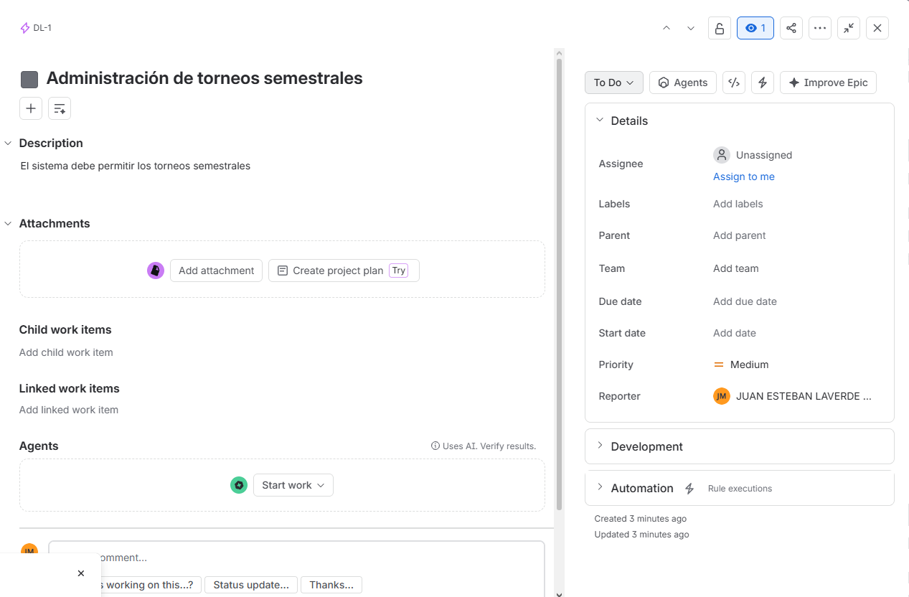

### 2. Historias de usuario:
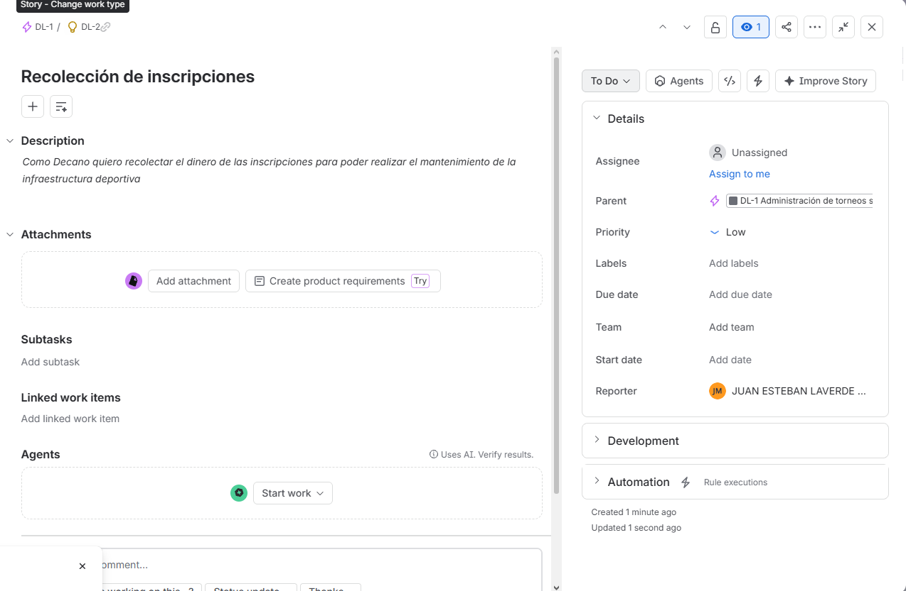
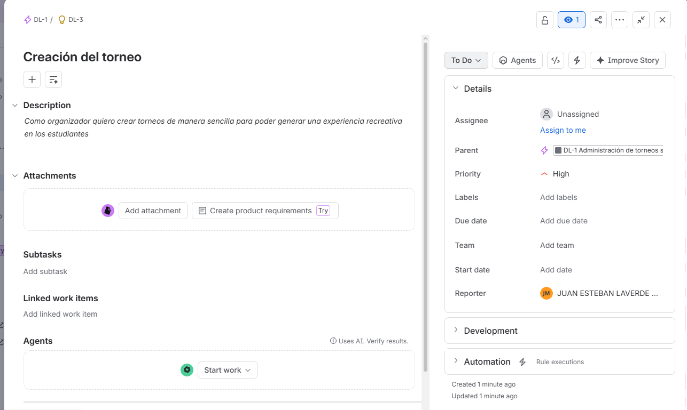
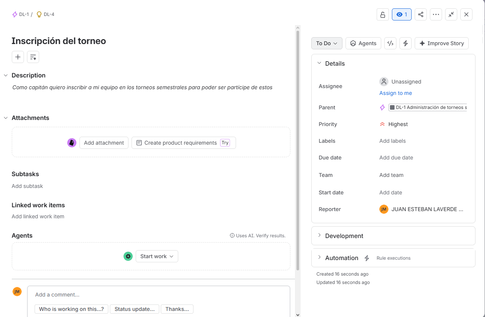

### 3. Tareas:
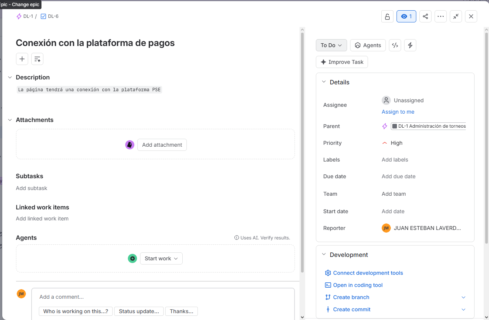
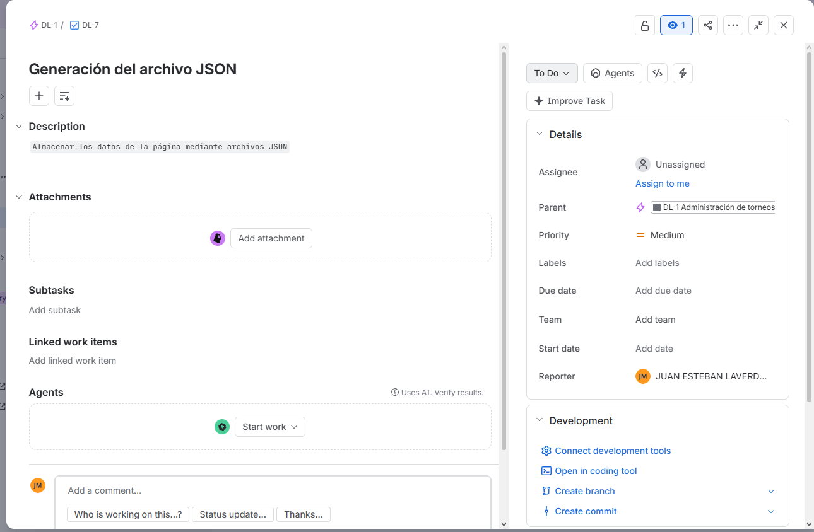
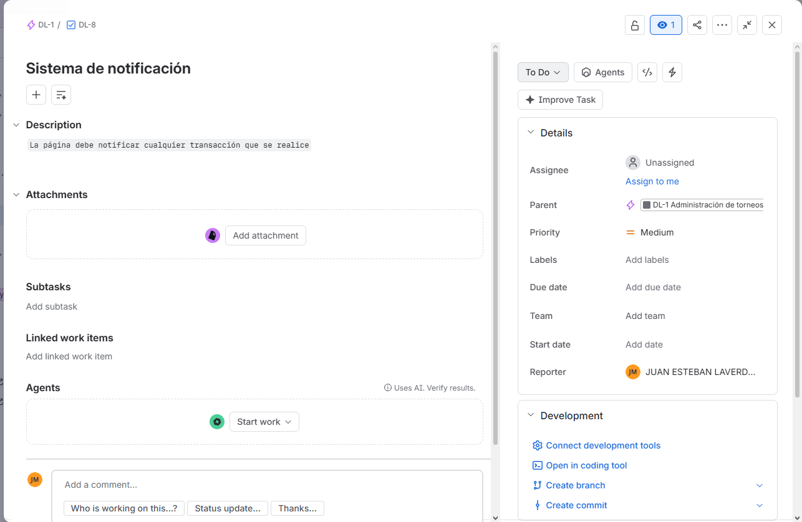
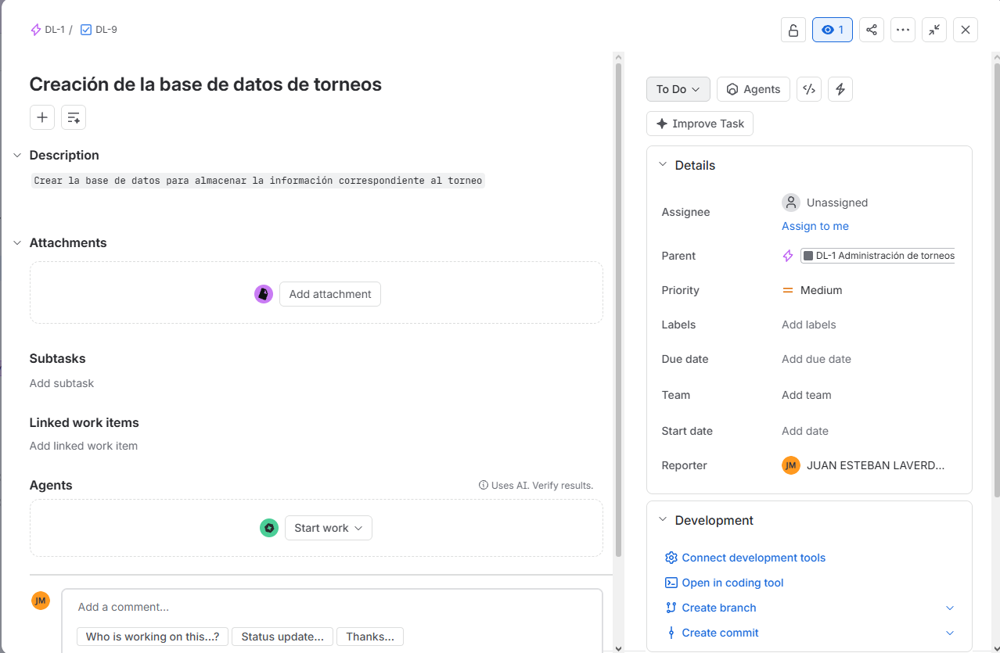
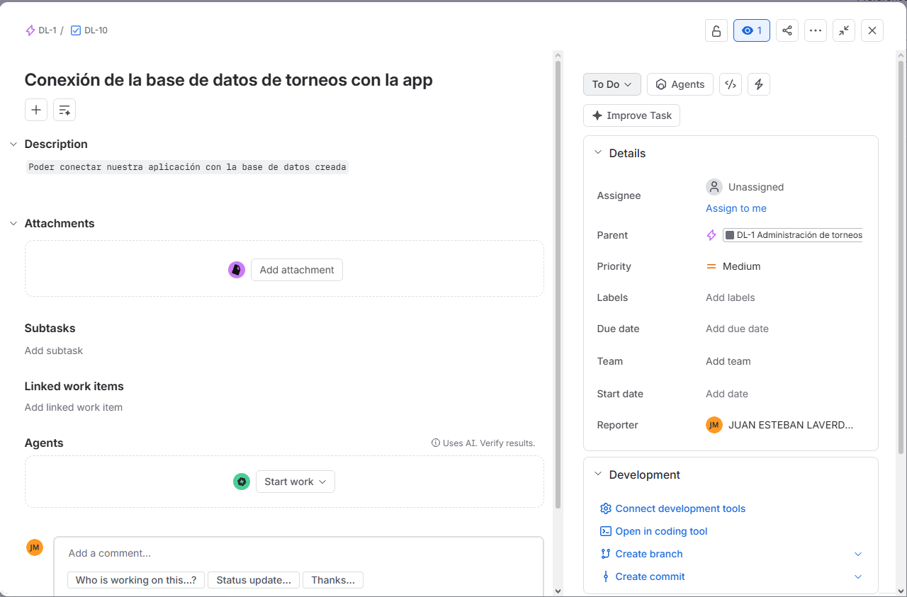
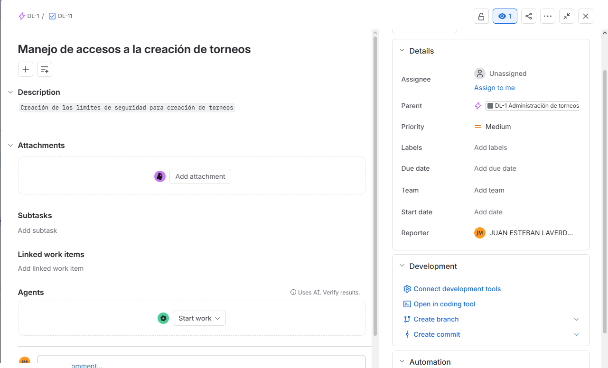
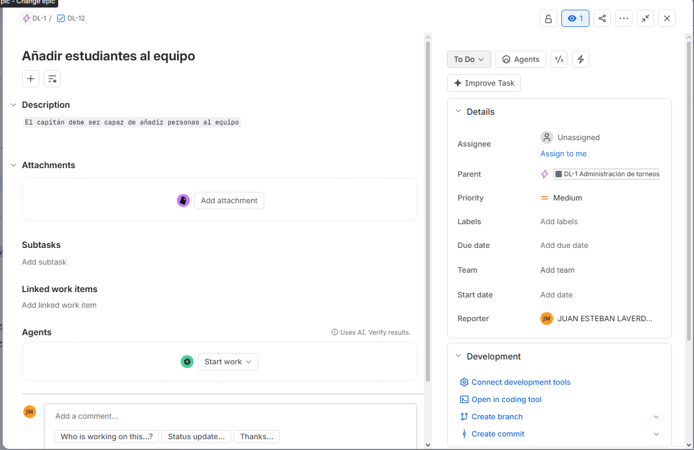
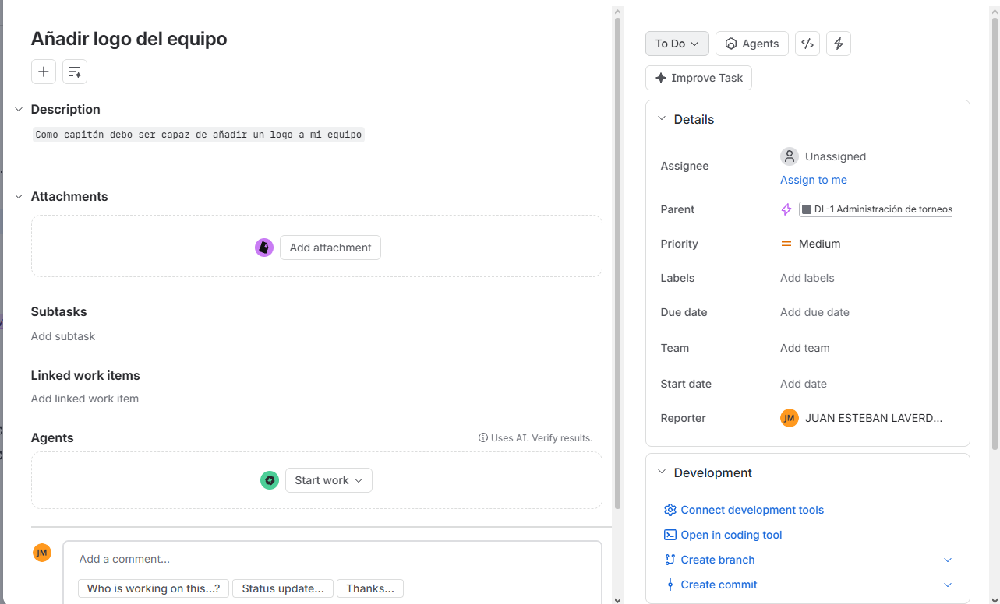
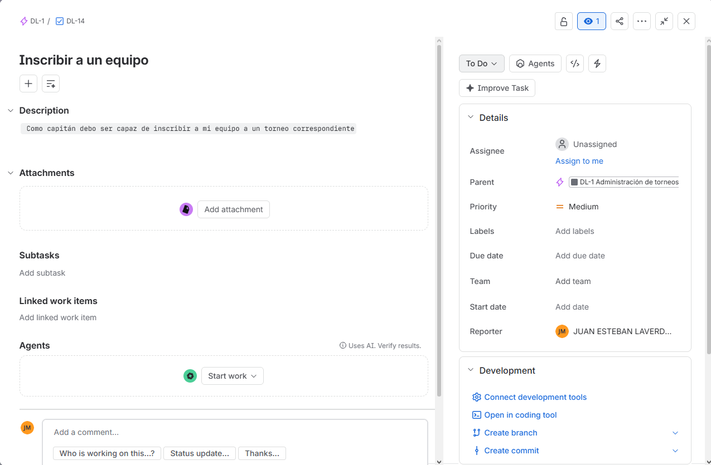
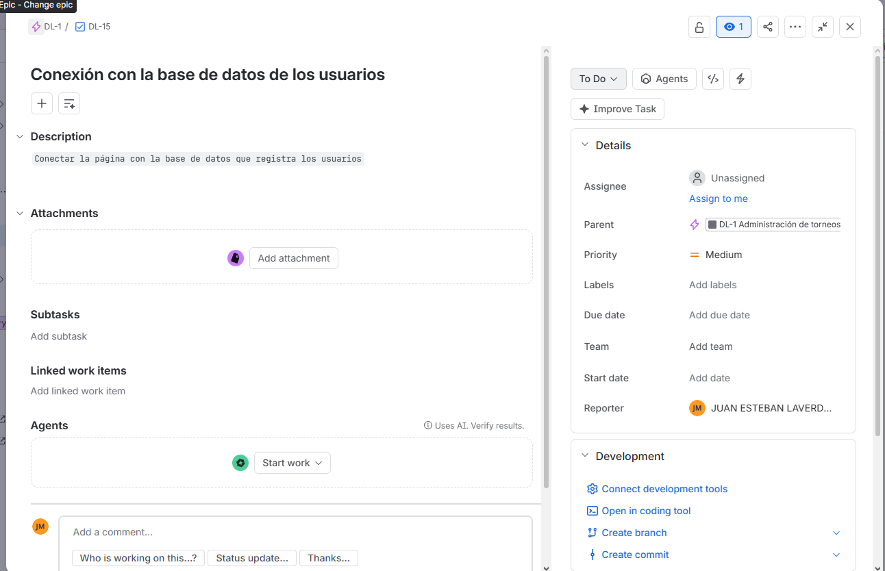
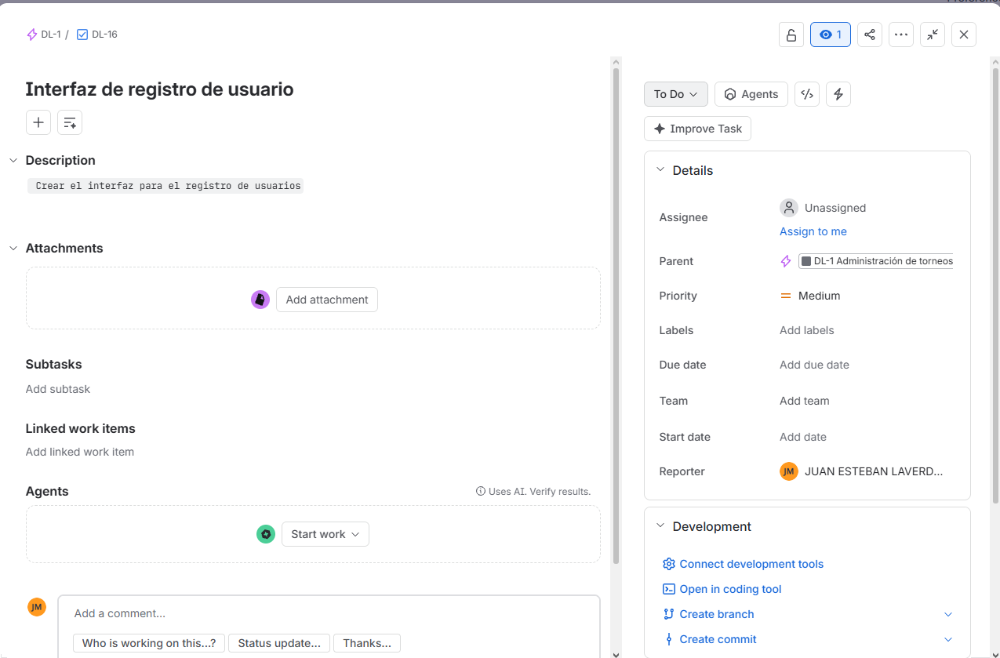

### 4. Cronograma:
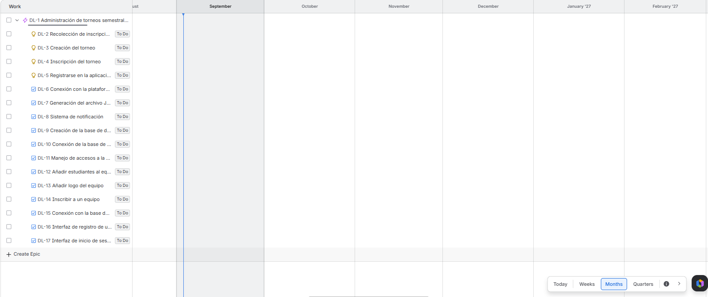

### Sprint Backlog
Para el Sprint 1, se han seleccionado las historias de usuario asociadas a la creación y configuración inicial de los torneos, priorizándolas debido a que constituyen el núcleo fundamental sobre el cual se edifican los demás módulos de la plataforma TechCup. Tomando como base la sesión de Planning Poker y el análisis de complejidad realizado por el equipo, estas historias fueron estimadas con los puntos de esfuerzo necesarios para asegurar que la lógica central de gestión esté operativa desde el primer ciclo de cuatro semanas. Las tareas derivadas se han distribuido entre los integrantes del grupo para garantizar un flujo de trabajo constante y una correcta trazabilidad en el desarrollo del proyecto.

